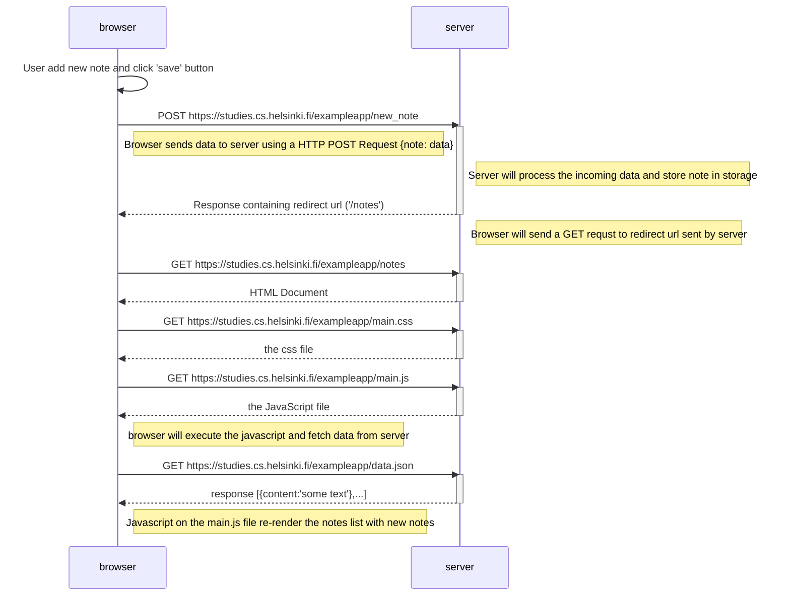

```mermaid
sequenceDiagram
    participant browser
    participant server

    browser->>browser: User add new note and click 'save' button

    browser->>server: POST https://studies.cs.helsinki.fi/exampleapp/new_note
    activate server

    note right of browser: Browser sends data to server using a HTTP POST Request {note: data}

    note right of server: Server will process the incoming data and store note in storage
    server-->>browser: Response containing redirect url ('/notes')
    deactivate server

    note right of server: Browser will send a GET requst to redirect url sent by server

    browser->>server: GET https://studies.cs.helsinki.fi/exampleapp/notes
    activate server
    server-->>browser: HTML Document
    deactivate server

    browser->>server: GET https://studies.cs.helsinki.fi/exampleapp/main.css
    activate server
    server-->>browser: the css file
    deactivate server

    browser->>server: GET https://studies.cs.helsinki.fi/exampleapp/main.js
    activate server
    server-->>browser: the JavaScript file
    deactivate server

    note right of browser: browser will execute the javascript and fetch data from server

    browser->>server: GET https://studies.cs.helsinki.fi/exampleapp/data.json
    activate server
    server-->>browser: response [{content:'some text'},...]
    deactivate server

    note right of browser: Javascript on the main.js file re-render the notes list with new notes


```
