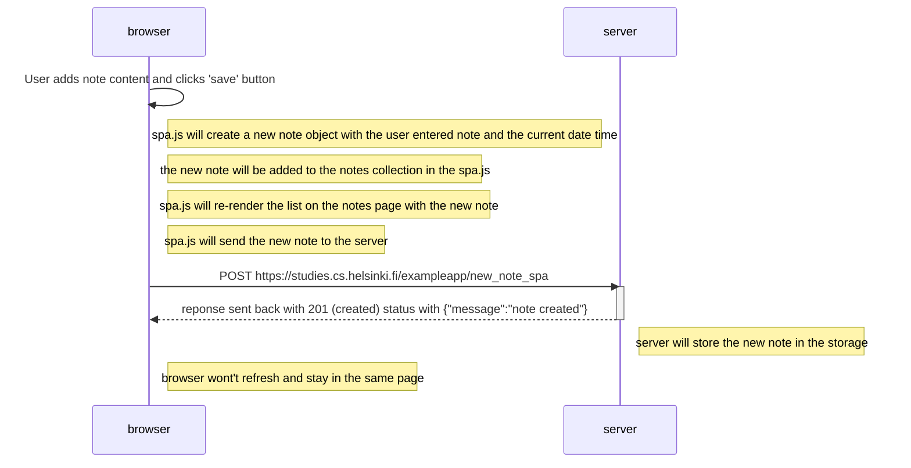

```mermaid
sequenceDiagram
  participant browser
  participant server
  
  browser->>browser: User adds note content and clicks 'save' button
  
  note right of browser: spa.js will create a new note object with the user entered note and the current date time
  note right of browser: the new note will be added to the notes collection in the spa.js
  note right of browser: spa.js will re-render the list on the notes page with the new note
  note right of browser: spa.js will send the new note to the server
  
  browser->>server: POST https://studies.cs.helsinki.fi/exampleapp/new_note_spa
  activate server
  server-->>browser: reponse sent back with 201 (created) status with {"message":"note created"}
  deactivate server
  note right of server: server will store the new note in the storage
 
  
  note right of browser: browser wont't refresh and stay in the same page
  
  
  


```
